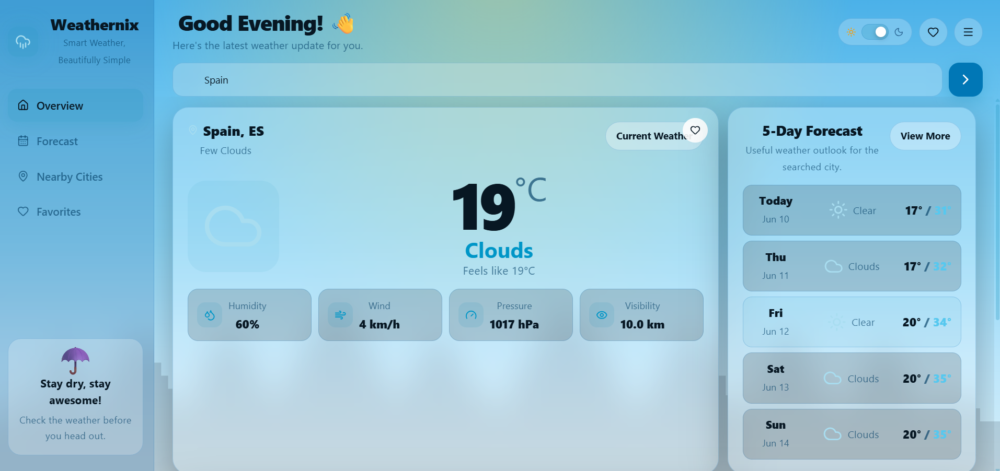
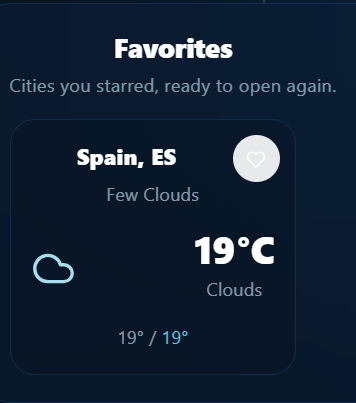
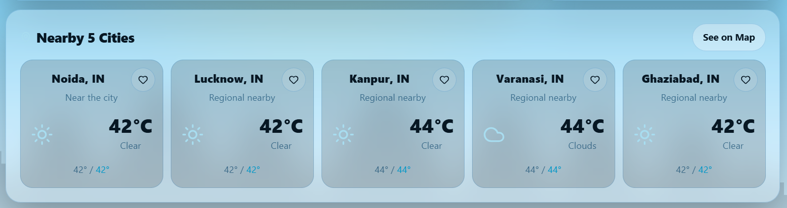

<div align="center">

# 🌤️ WeatherNix V1

### A sleek weather dashboard built with React & OpenWeather API

[](https://weathernix-weather-app.onrender.com)
[](https://react.dev)
[](https://openweathermap.org/api)
[](https://render.com)

<br/>

> ⚠️ **This is V1** — A working version with core features.
> V2 is coming with a complete redesign, more features, and a better UI.

</div>

---

## 📸 Screenshots

| Dashboard | Favorites | Nearby Cities |
|:---------:|:---------:|:-------------:|
|  |  |  |

---

## ✨ Features

- 🔍 **City Search** — Look up real-time weather for any city worldwide
- ❤️ **Favorites** — Save your frequently checked cities
- 🌆 **Nearby Cities** — See weather for cities around your location
- 🌡️ **Live Data** — Temperature, humidity, wind speed, and weather conditions
- 🌤️ **Dynamic Backgrounds** — UI adapts based on current weather
- 📱 **Responsive Design** — Works across desktop and mobile

---

## 🛠️ Tech Stack

| Layer | Tech |
|-------|------|
| Frontend | React + JavaScript |
| Styling | CSS |
| API | OpenWeatherMap API |
| Build | Vite |
| Deployment | Render |

---

## 🚀 Run Locally

```bash
# 1. Clone the repo
git clone https://github.com/swastikjha008-jpg/weathernix-weather-app.git

# 2. Go into the project folder
cd weathernix-weather-app/weathernix-weather-api

# 3. Install dependencies
npm install

# 4. Add your OpenWeather API key
# Create a .env file and add:
# VITE_WEATHER_API_KEY=your_api_key_here

# 5. Start the app
npm run dev
```

> 🔑 Get a free API key at [openweathermap.org](https://openweathermap.org/api)

---

## 📁 Project Structure

```
weathernix-weather-app/
├── weathernix-weather-api/   # Main React app
│   ├── src/
│   ├── public/
│   ├── package.json
│   └── vite.config.js
├── light-mode-weather-dashboard.png
├── favorites-weather-card.png
├── nearby-cities-weather.png
├── weather-city-cards.png
└── README.md
```

---

## ⚠️ Known Limitations in V1

These are known issues that will be fixed in V2:

- [ ] No dark mode
- [ ] No 5-day / 7-day forecast
- [ ] No geolocation auto-detect
- [ ] UI needs a full redesign
- [ ] No loading skeletons
- [ ] Mobile responsiveness can be improved

---

## 🔮 What's Coming in V2

> V2 is currently in development and will be pushed soon.

- 🌙 Day / Night mode with animated backgrounds
- 📅 Extended weather forecast (5-day)
- 📍 Auto-detect user location
- ⚡ Faster load times and better performance
- 🎨 Completely redesigned UI
- 💾 Persistent favorites with localStorage

---

## 👨‍💻 Author

**Swastik Jha**
---
<div align="center">

*V1 built while learning React & API integration · V2 coming soon 🚀*

</div>
